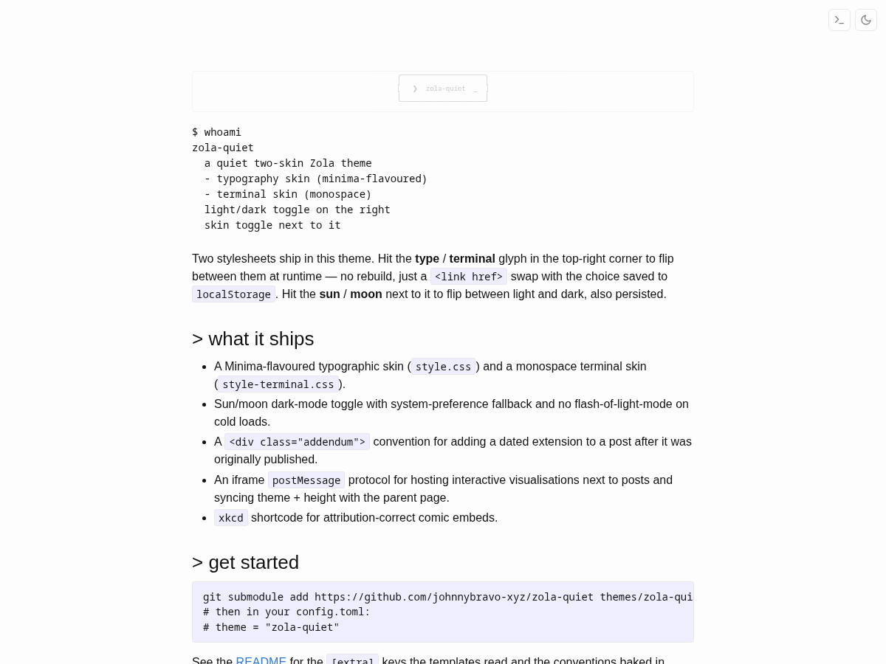

# zola-quiet

A quiet, two-skin Zola theme. Two stylesheets ship together — a
Minima-flavoured typographic skin and a monospace terminal skin —
and a runtime toggle in the top-right flips between them with the
choice saved to `localStorage`. A second toggle handles light/dark
in the same way.

No frameworks, no fonts hot-linked from a CDN, no analytics, no
search, no comments. Static HTML out of Zola, two CSS files, two
tiny inline scripts.



## What you get

- **Two skins.** `style.css` is the default (Minima-flavoured —
  system sans, ~740 px column, weight-400 headings, blue links).
  `style-terminal.css` is the alternate (monospace everywhere,
  `→ ` list markers, side-by-side sidebar on desktop).
- **Light/dark toggle.** Sun/moon icon, system-preference default,
  flash-free on cold loads (the choice is applied to `<html>`
  before the stylesheet is fetched).
- **Skin toggle.** Type/terminal glyph next to the theme toggle.
  Click to swap stylesheets at runtime — no rebuild.
- **Addendum convention.** `<div class="addendum">` for adding
  dated extensions to posts after their original publish date.
  Visible eyebrow, left rule, tinted background, dark-mode aware.
- **xkcd shortcode.** `{{ xkcd(num=…, title=…, alt=…) }}` renders a
  `<figure class="xkcd">` with CC BY-NC 2.5 attribution.
- **Iframe `postMessage` protocol.** If you embed an interactive
  visualiser as an iframe, the parent posts the current theme to
  the child on load and on `data-theme` change; the child can post
  height back to autosize the iframe. See your posts' iframe
  blocks for the wiring (a copy-paste `<script>` snippet sits next
  to each iframe).
- **Theme-aware syntax highlighting.** Opt-in: enable Zola's
  class-mode highlighting and pick a light/dark theme pair; the
  base template loads both `giallo-*.css` files and flips them in
  step with the toggle. See _Syntax highlighting_ below.
- **Tag chips, post-meta, atom feed, sitemap, 404 page.** All the
  Zola defaults wired to the theme styles.

## Install

```bash
cd your-site
git submodule add https://github.com/johnnybravo-xyz/zola-quiet themes/zola-quiet
```

Then in your `config.toml`:

```toml
theme = "zola-quiet"
```

## `[extra]` keys the templates read

All optional. Every block is ``-guarded so the theme
degrades cleanly if a key isn't set.

| Key                       | Used by               | Effect |
|---------------------------|-----------------------|--------|
| `extra.author`              | `<meta>`, footer line | "© YEAR <author>" |
| `extra.github`              | `index.html`, footer  | GitHub icon + connect link |
| `extra.linkedin`            | `index.html`, footer  | LinkedIn icon + connect link |
| `extra.email`               | `index.html`, footer  | Mail icon + connect link |
| `extra.ascii_signature`     | `base.html` sidebar   | Multi-line ASCII shown as a quiet signature above the content |
| `extra.homepage_post_limit` | `index.html`          | Cap the front-page post list to N most recent posts. When more exist, a "see all M posts →" link appears below the list. Unset or `0` shows every post. |

Example:

```toml
[extra]
author = "Jane Doe"
github = "janedoe"
linkedin = "janedoe"
email = "jane@example.com"
ascii_signature = """
░░░░░░░░░░░░
░░ HELLO  ░░
░░░░░░░░░░░░
"""
```

## Syntax highlighting

The theme is wired for Zola 0.22+ class-mode syntax highlighting,
but doesn't enable it for you — you opt in from your site's
`config.toml`. When you do, the base template loads two CSS files
(`/giallo-light.css` and `/giallo-dark.css`) with media-query
gating, and the theme toggle flips them in step with the light/dark
toggle.

To enable, add this to your site's `config.toml`:

```toml
[markdown.highlighting]
style = "class"
light_theme = "github-light"
dark_theme = "github-dark"
```

Zola emits the two CSS files automatically on the next build. The
filenames (`giallo-light.css` and `giallo-dark.css`) are fixed by
Zola — don't rename them; the theme's `<link>` tags expect those
exact paths.

The theme names come from
[shikijs/textmate-grammars-themes](https://github.com/shikijs/textmate-grammars-themes/tree/main/packages/tm-themes/themes)
(VSCode-flavoured TextMate themes that Zola 0.22+ bundles via the
`giallo` highlighter). Any matched light/dark pair works — common
choices are `github-light`/`github-dark`, `one-light`/`one-dark-pro`,
`ayu-light`/`ayu-dark`, `everforest-light`/`everforest-dark`.

If you'd rather _not_ have syntax highlighting, simply omit the
`[markdown.highlighting]` block; the `<link>` tags will 404 on
those two files but the rest of the site is unaffected. (Or fork
the base template and drop the two lines.)

## Templates you can override

Drop a file with the same name into your site's `templates/` to
override the theme's. The theme ships:

- `base.html` — page chrome, toggles, controls, footer
- `index.html` — homepage (post list + connect block)
- `section.html` — post list pages (e.g. `/posts/`)
- `page.html` — individual posts with date + tag chips
- `taxonomy_list.html` — `/tags/`
- `taxonomy_single.html` — `/tags/foo/`
- `shortcodes/xkcd.html` — comic embed shortcode

## CSS conventions

Useful classes the stylesheets style:

- `pre.whoami` — borderless monospace block, no background; good for
  a `$ whoami` opener on the homepage.
- `.post-list` — un-bulleted post list with `<time>` prefix.
- `.tag-chip` — rounded pill rendered for each tag.
- `figure.xkcd` — bordered comic figure with attribution caption.
- `.addendum`, `.addendum-eyebrow` — the dated-extension block.
- `.controls`, `.skin-toggle`, `.theme-toggle` — top-right toggle pair.

## Run the demo

```bash
git clone https://github.com/johnnybravo-xyz/zola-quiet
cd zola-quiet
zola serve
```

`config.toml` at the repo root is a minimal demo configuration
that's only used when building this repo in isolation.

## License

MIT — see `LICENSE`.
